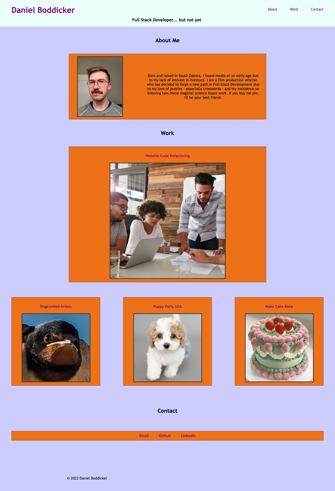
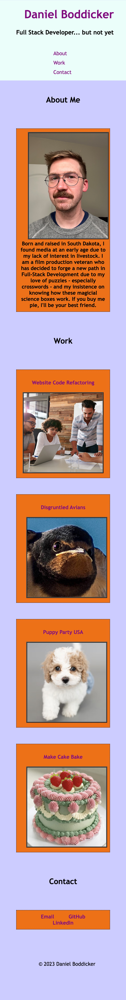

# Homework 02 - Portfolio Start Page

## Description

For this assignment, I was tasked with creating the home page of an online portfolio. This online portfolio will be a place for me to display all the work I will complete over this course. I was not given starting code and had to draw on my lessons in HTML and CSS to built a sit entirely from scratch.

It is not the smoothest site, but it is one I hope to update and refine as I get more and more comfortable with coding. This was a daunting assignment and I'm proud to achieve what I have.

## Installation

N/A

## Usage

This webpage was built with repsonsive elements that will readjust as the screen size changes. Full screen and phone screen examples below. Also, there are clickable links in the header to each section along with each image being linked to the corresponding project or a temporary website.

## Credits

A lof of credit goes to Bryan and Shawn for putting up with me and providing the ground floor for this assisngment as it was created based on code I've worked with before. Additionally, www.w3schools.com and "HTML & CSS" by Jon Duckett for filling in the gaps.

Finally, thanks to my fellow students for working out all out prolems together.

## License

Please refer to the LICENSE in the repository.

## Deloyed

Github: https://github.com/JasperJackalope/homework02-portfolio
Website: https://jasperjackalope.github.io/homework02-portfolio/